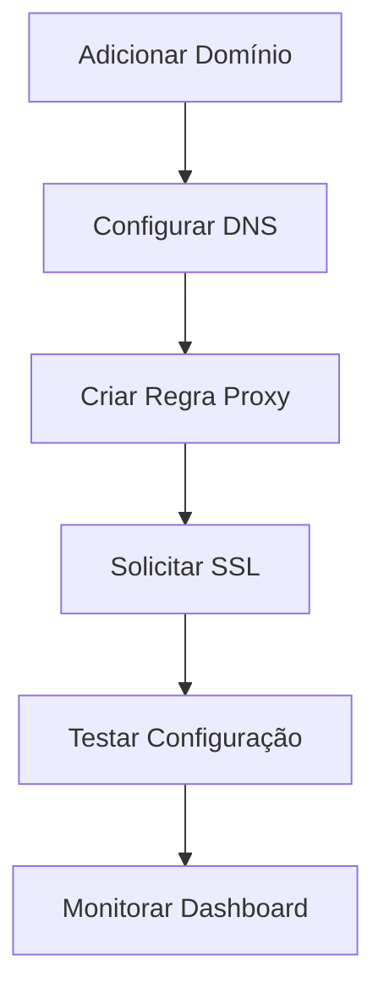

# NetPilot - Sistema de Proxy Reverso e Gestão SSL

<div align="center">


**Sistema completo de gestão de proxy reverso, SSL e balanceamento de carga com interface web moderna**

[](https://opensource.org/licenses/MIT)
[](https://nodejs.org/)
[](https://postgresql.org/)
[](https://docker.com/)

</div>

## 📋 Índice

- [Visão Geral](#visão-geral)
- [Recursos](#recursos)
- [Arquitetura](#arquitetura)
- [Instalação Rápida](#instalação-rápida)
- [Configuração](#configuração)
- [Uso](#uso)
- [Desenvolvimento](#desenvolvimento)
- [API](#api)
- [Deployment](#deployment)
- [Contribuição](#contribuição)
- [Licença](#licença)

## 🎯 Visão Geral

NetPilot é uma solução moderna e completa para gerenciamento de proxy reverso, certificados SSL e balanceamento de carga. Combinando a robustez do Traefik e Nginx com uma interface web intuitiva desenvolvida em Next.js e backend em NestJS.

### Principais Funcionalidades

- 🌐 **Gestão de Domínios**: Configuração centralizada de múltiplos domínios
- 🔀 **Proxy Reverso**: Regras flexíveis de roteamento com Traefik e Nginx
- 🔒 **SSL Automático**: Integração com Let's Encrypt para certificados automáticos
- 🚀 **Redirects**: Gestão avançada de redirecionamentos (301, 302, 307, 308)
- 📊 **Dashboard**: Métricas em tempo real e monitoramento
- 🔐 **Autenticação**: Sistema seguro com JWT e refresh tokens
- 📝 **Logs**: Sistema completo de auditoria e logs estruturados
- 🐳 **Docker**: Deploy simplificado com Docker Compose

## ✨ Recursos

### Interface Web
- ✅ Dark theme moderno e responsivo
- ✅ Dashboard com métricas em tempo real
- ✅ Gestão visual de domínios e regras
- ✅ Editor de configurações avançadas
- ✅ Sistema de notificações
- ✅ Histórico de alterações

### Backend Robusto
- ✅ API RESTful completa com NestJS
- ✅ Banco PostgreSQL com TypeORM
- ✅ Autenticação JWT com refresh
- ✅ Validação robusta com class-validator
- ✅ Documentação OpenAPI/Swagger
- ✅ Testes automatizados (>90% cobertura)

### Infraestrutura
- ✅ Traefik como proxy principal
- ✅ Nginx para casos específicos
- ✅ PostgreSQL para persistência
- ✅ Let's Encrypt para SSL
- ✅ Docker Compose para orquestração
- ✅ Configuração dinâmica sem restart

## 🏗️ Arquitetura

```
┌─────────────────┐    ┌─────────────────┐    ┌─────────────────┐
│   Internet      │    │   Traefik       │    │   NetPilot      │
│   ┌─────────┐   │    │   ┌─────────┐   │    │   ┌─────────┐   │
│   │ User    │   │───▶│   │ Router  │   │───▶│   │ Backend │   │
│   └─────────┘   │    │   └─────────┘   │    │   └─────────┘   │
└─────────────────┘    │   ┌─────────┐   │    │   ┌─────────┐   │
                       │   │ SSL     │   │    │   │Frontend │   │
                       │   └─────────┘   │    │   └─────────┘   │
                       └─────────────────┘    └─────────────────┘
                                             │
                       ┌─────────────────┐    │   ┌─────────────────┐
                       │   Nginx         │    │   │   PostgreSQL    │
                       │   ┌─────────┐   │◀───┘   │   ┌─────────┐   │
                       │   │ Config  │   │        │   │Database │   │
                       │   └─────────┘   │        │   └─────────┘   │
                       └─────────────────┘        └─────────────────┘
```

### Componentes

- **Frontend**: Next.js 14 + TypeScript + Tailwind CSS (porta 3000)
- **Backend**: NestJS + TypeScript + TypeORM (porta 3001)
- **Database**: PostgreSQL 15 (porta 5432)
- **Proxy**: Traefik v3 (portas 80, 443, 8080)
- **Web Server**: Nginx (porta 8081)

## 🚀 Instalação Rápida

### Pré-requisitos

- **Docker** 20.10+
- **Docker Compose** 2.0+
- **Node.js** 18+ (para desenvolvimento)
- **Git**

### Setup Automático

```bash
# 1. Clone o repositório
git clone https://github.com/seu-usuario/netpilot.git
cd netpilot

# 2. Execute o script de setup
chmod +x scripts/setup.sh
./scripts/setup.sh

# 3. Aguarde a inicialização
docker-compose logs -f
```

### Setup Manual

```bash
# 1. Clone e configure
git clone https://github.com/seu-usuario/netpilot.git
cd netpilot

# 2. Copie as variáveis de ambiente
cp .env.example .env

# 3. Ajuste as configurações no .env
nano .env

# 4. Inicie os serviços
docker-compose up -d --build

# 5. Verifique o status
docker-compose ps
```

## ⚙️ Configuração

### Variáveis de Ambiente Principais

```bash
# Aplicação
NODE_ENV=development
JWT_SECRET=seu-jwt-secret-muito-forte
JWT_REFRESH_SECRET=seu-refresh-secret-muito-forte

# Banco de Dados
DB_HOST=db
DB_PORT=5432
DB_NAME=netpilot
DB_USER=netpilot
DB_PASS=sua-senha-forte

# SSL/ACME
ACME_EMAIL=seu-email@dominio.com
ACME_STAGING=true
ACME_PROVIDER=letsencrypt

# URLs de Serviço
FRONTEND_URL=http://meadadigital.com:3000
BACKEND_URL=http://meadadigital.com:3001
TRAEFIK_URL=http://meadadigital.com:8080
```

### Credenciais Padrão

```
Email: admin@netpilot.local
Senha: admin123
```

**⚠️ IMPORTANTE**: Altere as credenciais padrão antes do deploy em produção!

## 📖 Uso

### 1. Acesse a Interface

- **Dashboard Principal**: http://meadadigital.com:3000
- **API Documentation**: http://meadadigital.com:3001/api/docs
- **Traefik Dashboard**: http://meadadigital.com:8080

### 2. Primeira Configuração

1. **Login** com credenciais padrão
2. **Adicione seu primeiro domínio** em `/domains`
3. **Configure regra de proxy** em `/proxy-rules`
4. **Solicite certificado SSL** em `/ssl-certificates`
5. **Monitore no dashboard** em `/dashboard`

### 3. Fluxo Típico



## 🛠️ Desenvolvimento

### Estrutura do Projeto

```
netpilot/
├── backend/                 # API NestJS
│   ├── src/
│   │   ├── auth/           # Autenticação
│   │   ├── domains/        # Gestão de domínios
│   │   ├── proxy-rules/    # Regras de proxy
│   │   ├── redirects/      # Redirecionamentos
│   │   ├── ssl-certificates/ # Certificados SSL
│   │   ├── logs/           # Sistema de logs
│   │   └── dashboard/      # Métricas
│   └── test/               # Testes
├── frontend/               # Interface Next.js
│   ├── src/
│   │   ├── app/            # Páginas (App Router)
│   │   ├── components/     # Componentes React
│   │   ├── lib/            # Utilitários
│   │   └── types/          # Tipos TypeScript
│   └── cypress/            # Testes E2E
├── configs/                # Configurações
│   ├── nginx/              # Templates Nginx
│   ├── traefik/            # Config Traefik
│   └── ssl/                # Certificados
├── docs/                   # Documentação
└── scripts/                # Scripts utilitários
```

### Comandos de Desenvolvimento

```bash
# Backend
cd backend
npm install
npm run start:dev          # Servidor de desenvolvimento
npm run build             # Build de produção
npm run test              # Testes unitários
npm run test:e2e          # Testes E2E
npm run lint              # Linting

# Frontend
cd frontend
npm install
npm run dev               # Servidor de desenvolvimento
npm run build             # Build de produção
npm run type-check        # Verificação tipos
npm run lint              # Linting

# Docker
docker-compose up -d --build    # Iniciar todos
docker-compose logs -f          # Ver logs
docker-compose down             # Parar todos
```

### Contribuindo

1. Fork o projeto
2. Crie uma branch para sua feature (`git checkout -b feature/AmazingFeature`)
3. Commit suas mudanças (`git commit -m 'Add some AmazingFeature'`)
4. Push para a branch (`git push origin feature/AmazingFeature`)
5. Abra um Pull Request

## 📡 API

### Documentação Completa

- **Swagger UI**: http://meadadigital.com:3001/api/docs
- **OpenAPI JSON**: http://meadadigital.com:3001/api/docs-json
- **Postman Collection**: `docs/api/postman/NetPilot.json`

### Endpoints Principais

```bash
# Autenticação
POST /auth/login           # Login
POST /auth/refresh         # Refresh token
GET  /auth/me             # Perfil do usuário

# Domínios
GET    /domains           # Listar domínios
POST   /domains           # Criar domínio
GET    /domains/:id       # Obter domínio
PUT    /domains/:id       # Atualizar domínio
DELETE /domains/:id       # Excluir domínio

# Proxy Rules
GET    /proxy-rules       # Listar regras
POST   /proxy-rules       # Criar regra
PUT    /proxy-rules/:id   # Atualizar regra
DELETE /proxy-rules/:id   # Excluir regra

# SSL Certificates
GET    /ssl-certificates  # Listar certificados
POST   /ssl-certificates  # Solicitar certificado
DELETE /ssl-certificates/:id # Revogar certificado
```

## 🚀 Deployment

### Produção com Docker

```bash
# 1. Prepare o ambiente
cp .env.example .env.prod
nano .env.prod

# 2. Configure para produção
export NODE_ENV=production
export ACME_STAGING=false

# 3. Deploy
docker-compose -f docker-compose.prod.yml up -d --build

# 4. Verificar status
docker-compose -f docker-compose.prod.yml ps
```

### Configurações de Produção

```bash
# Segurança
JWT_SECRET=<token-muito-forte-256-bits>
JWT_REFRESH_SECRET=<refresh-token-muito-forte-256-bits>
DB_PASS=<senha-banco-muito-forte>

# SSL
ACME_STAGING=false
ACME_EMAIL=admin@meadadigital.com

# URLs
FRONTEND_URL=https://meadadigital.com
BACKEND_URL=https://api.meadadigital.com
```

### Backup

```bash
# Backup automático
./scripts/backup.sh

# Backup manual
docker exec netpilot-db pg_dump -U netpilot netpilot > backup.sql
```

## 📊 Monitoramento

### Métricas Disponíveis

- **Domínios ativos/inativos**
- **Certificados SSL válidos/expirados**
- **Requisições por domínio**
- **Latência média de resposta**
- **Status de saúde dos serviços**
- **Logs de sistema em tempo real**

### Health Checks

```bash
# Verificar saúde dos serviços
curl http://meadadigital.com:3001/health

# Status do banco
curl http://meadadigital.com:3001/health/database

# Métricas Prometheus
curl http://meadadigital.com:3001/metrics
```

## 🔧 Troubleshooting

### Problemas Comuns

**Porto já em uso**
```bash
sudo netstat -tulpn | grep :3000
sudo kill -9 <PID>
```

**Banco não conecta**
```bash
docker-compose logs db
docker-compose restart db
```

**SSL falha**
```bash
docker-compose logs traefik
# Verificar logs Let's Encrypt
```

**502 Bad Gateway**
```bash
# Verificar configurações Nginx
docker-compose logs nginx
cat configs/nginx/*.conf
```

### Logs Úteis

```bash
# Todos os serviços
docker-compose logs -f

# Serviço específico
docker-compose logs -f backend
docker-compose logs -f frontend
docker-compose logs -f traefik

# Logs com timestamp
docker-compose logs -f -t backend
```

## 📚 Documentação Adicional

- [Arquitetura Detalhada](ARCHITECTURE.md)
- [Guia de Deployment](DEPLOYMENT.md)
- [Desenvolvimento](DEVELOPMENT.md)
- [Documentação da API](API.md)
- [Segurança](SECURITY.md)
- [Troubleshooting](TROUBLESHOOTING.md)

## 📄 Licença

Este projeto está licenciado sob a MIT License - veja o arquivo [LICENSE](LICENSE) para detalhes.

## 🤝 Suporte

- **Issues**: [GitHub Issues](https://github.com/seu-usuario/netpilot/issues)
- **Discussões**: [GitHub Discussions](https://github.com/seu-usuario/netpilot/discussions)
- **Email**: support@netpilot.local

---

<div align="center">

**Desenvolvido com ❤️ pela equipe NetPilot**

[Website](https://netpilot.local) • [Documentação](docs/) • [API](http://meadadigital.com:3001/api/docs)

</div>